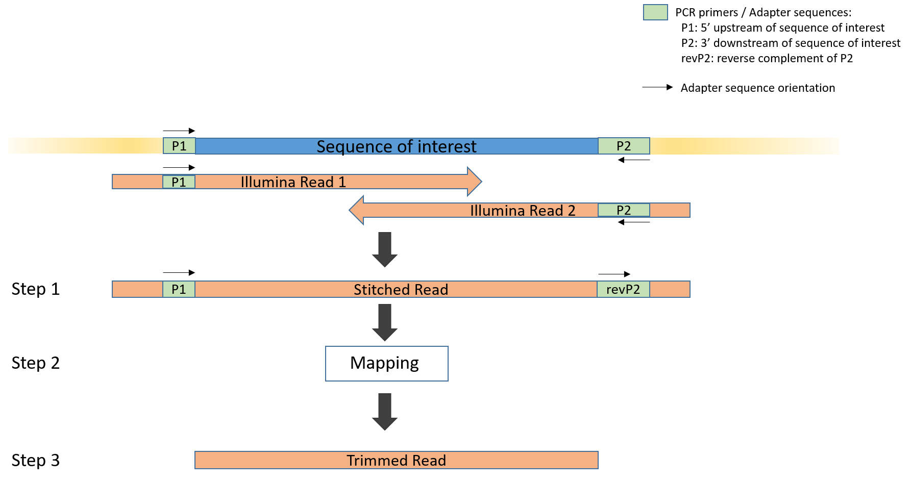
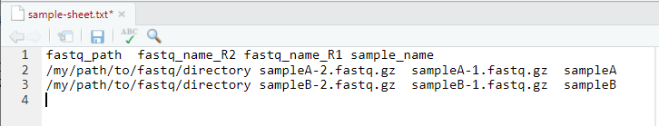
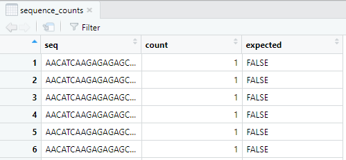
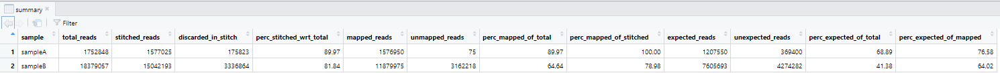

# README #

### What is this repository for? ###

This is a Snakemake pipeline for QC and analysis of deep mutational scanning (DMS) data.\
A deep mutational scan (DMS) study profiles all possible amino acid substitutions across a small region of a protein. Each substitution is computationally defined, synthesized, cloned into plasmids, and transfected into the cell line.
After the experiment, a PCR is performed to amplify the protein region of interest. The region of interest is typically small enough that it can be covered by overlapping forward and reverse Illumina reads. After PCR, this region is then sequenced.
The input for this pipeline are the forward and reverse fasta files, the nucleotide sequences of the expected mutant clones in the library, and the PCR primers used to amplify the region of interest (to filter from the data).

The following steps are performed for QC analysis:

1. Merge paired-end reads into one sequence
2. Map merged sequences onto the reference sequence
3. Trim adapter sequences from mapped sequences
4. Optional: Compare trimmed sequences with expected mutant sequences
5. Count unique sequences from step 3 or 4 respectively
6. Summarize the number of sequences passing steps 1-4
7. Quality control analysis

 Overview of steps 1-3. 

### How does it work? ###

This pipeline is implemented using Snakemake within a conda environment. To use the pipeline, you will need

 * A working conda installation
 * A conda environment with Snakemake installed in it

Snakemake then manages creating additional conda environments locally and installing the correct packages into them for each step (seamless for me).

You can run the pipeline locally, or use Snakemake to manage job submission to the cluster.

### How do I get set up? ###
 * Create and activate a snakemake conda environment.

        conda create -n smk -c conda-forge mamba=0.24.0
        mamba activate smk
        mamba install -c conda-forge -c bioconda snakemake=6.10 python=3.8 drmaa

### How do I get started? ###

1. Create a new working directory that contains the Snakemake file, config file, and files in the envs and scripts directories. If you have git installed the easiest way to get these files is to clone them from Bitbucket. The goal is that you should be able to change just the config.yaml file to analyze data from a new set of samples.

        mkdir myDMS
        cd myDMS
        git clone https://github.com/Novartis/dms-pipeline.git

2. Update the `config.yaml` file with information about your project directories.\
    The following file paths/information are required for the analysis:

    * **sample sheet**. This is a tab delimited txt file containing the paths to the fastq files for each sample.\
    Four columns are required: fastq_path,	fastq_name_R2,	fastq_name_R1, and	sample_name. See `sample-sheet.txt` for an example.\
    

    * **reference sequence**. This is a fasta file containing the wt sequence used as reference sequence in the mapping step.\
    Note that this reference sequence very often is a codon optimized version of the wt sequence i.e. this sequence encodes for the wt amino acid sequence however the nucleotide sequence might differ from the wt nucleotide sequence. It encodes for a small protein region of interest and served as a template sequence to design the library of mutant sequences. The mapping step ensures that all defective reads or reads that do not originate from the sequence of interest are removed from further analysis.

    * **adapter sequences**. Paste 5' upstream and 3' downstream adapter sequences into the config file. Make sure to write both in the 5' to 3' direction of the sequence of interest. See overview figure for schematic representation of adapter sequences. Your collaborators most likely give you primer sequences P1 and P2. However, note the orientation of the adapter sequences - you might need the reverse complement of the 3' adapter.

    The following file is optional:
    * **expected mutants**. This is a tab delimited txt file containing the wt reference sequence and the expected mutant sequences. At least one column is required: amplicon.\
    Expected mutant sequences are derived from the wt reference sequence and differ from the wt sequence by point mutations that lead to specific mutations in the amino acid sequence. Such expected mutant sequences are part of the experimental setup e.g. comparing different mutations with respect to fitness. Unexpected mutants are most often due to sequencing errors.

    If you don't have reference, adapter or expected mutant sequences ask your collaborators to provide them to you.
3. Run the `workflow/Snakemake` file: \
    3.1 Activate your snakemake conda environment

        source activate smk

    3.2 Test that the pipeline should run on your local machine. This step doesn't execute the rules, but rather determines which rules will run and whether the necessary pre-requisites are in place. Execute the following command from within the directory containing the Snakemake file.

        # for early snakemake versions
        snakemake --use-conda -np
        # for snakemake versions 6.1.0 and above
        snakemake --use-conda --conda-frontend conda -np

   3.3 Run the pipeline on your local machine, granting it use of X cores

        # for early snakemake versions
        snakemake --use-conda --cores X
        # for snakemake versions 6.1.0 and above
        snakemake --use-conda --conda-frontend conda --cores X

4. Find one `sequence_counts.csv` file for each sample, a count matrix `count_matrix.csv`, and the `summary.txt` file in the output directories specified by you in the config file.

    * The `sequence_counts.csv` contains a table representation of all unique sequences, their counts and, optionally, if the sequence was expected or not. One such file can be found in each sample's directory in the parent output directory.\
    

    * The `count_matrix.csv` is an n x m count matrix with n the number of unique sequences and m the number of samples analysed. Optionally the `count_matrix_expected_mutants.csv` contains the counts for expected sequences only.

    * The `summary.txt` contains a table with the number and percentage passing or failing each step in the pipeline. Concretely, it contains the following columns: total reads (number of read pairs in your fastq files), stitched reads (number of Illumina read pairs successfully stitched into one sequence), mapped reads (number of reads mapped to the reference sequence and successfully trimmed the adapter sequences), and, optionally, expected reads (number of reads that are also listed in your file containing the expected mutants). Columns starting with "perc" contain percentages of either the number of reads with respect to the total number of reads, or the number of reads in the previous step. \
    

5. Find an html QC report in your output directory

6. Find log files for each step in the log directory in the ouput directory specified by you in the config file.